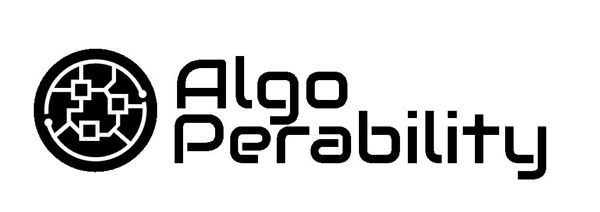

# Algorand Greenhouse Hack 2

This repository contains all the code that was developped during the Algorand Greenhouse Hack 2.

Our project, Algoperability, allows users to manage digital assets that live on a different blockchain than the blockchain on which those users are. For example managing and owning an NFT on blockchain Ethereum while the user is on Solana.

Our AlgoPerability infrastructure can be summarized into three main developed services:
- Cross-chain digital assets ownership transfer
- Cross-chain digital assets management
- All chain commercial targeting system and cross-chain NFT minting

To test our infrastructure, we took the use case of NFT collection that was deployed on Ropsten network for which the metadata was stored using Storj.
The address of the contract can be found [here](https://ropsten.etherscan.io/address/0x4f366451d1b2bEF10dFA9d5Eca4330dc3A939256).

# Video presentation of the AlgoPerability project
https://drive.google.com/file/d/1Fq8NTzHNPOtH-X3DP3l64_wdOvTI6AiE/view?usp=sharing

## Run the App
In the project directory, you can install the dependencies by running:
### `yarn install`

Then run the app with:
### `yarn start`

Open [http://localhost:3000](http://localhost:3000) to view it in the browser.
